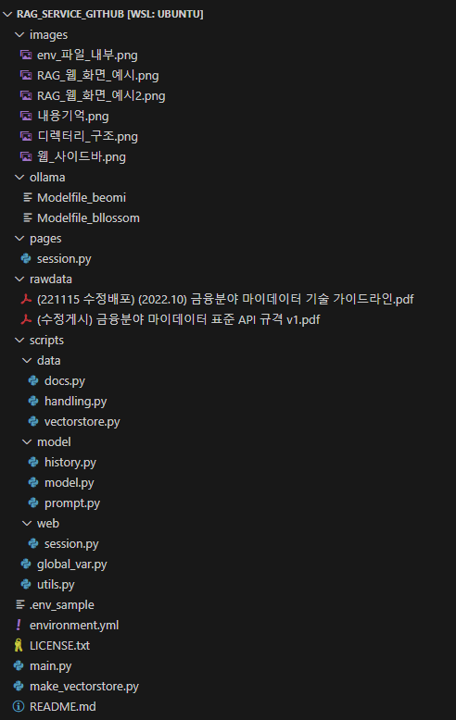

# RAG_service
A RAG web service implemented using Langchain and StreamLit

## A. 개요
### 1. 금융분야 마이데이터에 특화된 RAG 모델
해당 RAG(Retriever-Augmented Generation) 모델은 "금융분야 마이데이터"에 초점을 맞춘 답변을 생성하는 것에 특화되어 있습니다.
> * 해당 모델은 다음 데이터에 특화된 답변을 생성합니다.
>> * (221115 수정배포) (2022.10) 금융분야 마이데이터 기술 가이드라인.pdf
>> * (수정게시) 금융분야 마이데이터 표준 API 규격 v1.pdf 
> * ./rawdata 경로에 있는 pdf 파일을 교체하거나 추가하는 경우, 그 pdf에 대한 내용을 생성할 수 있으나, 품질이 떨어질 수 있습니다.

 
 
 

## B. 주요 구현 사항
### 1. 멀티턴 에이전트 지원
* 해당 RAG 모델은 대화 사용자와의 대화 내용을 기억하며, 사용자의 질문, 검색된 내용, 대화 내용을 참고하여 답변을 생성합니다.
> * 모델이 기억할 수 있는 대화의 양은 StreamLit으로 실행 가능한 RAG 웹을 통해 조정할 수 있습니다(Maximum memorize의 수치 조정).

 

### 2. 확장 가능한 프로젝트 구조
* 해당 RAG 모델은 StreamLit을 통해 서비스 되며, StreamLit을 통해 다양한 기능을 추가할 수 있습니다.
* 현재까지 구현된 추가 기능은 다음과 같습니다.
> * Session ID: Session ID 설정
> * Session Clear: Session ID에 대하여 Session 초기화
> * LLM: LLM 모델 설정(gpt3.5, llama3)
> * Retriever: Retriever 방식 설정(Ensemble, FAISS)
> * Retriever, Generate: Retriever가 검색한 문장들을 LLM 모델을 이용해 정리할지 여부
> * Documents size(1-10): Retriever가 검색해 올 문장의 수
> * Maximum memorize(3-10): Session이 기억할 최대 문답의 수
>> * LLaMA3는 한국어에 파인튜닝된 모델을 사용합니다.
>> * llama-3-Korean-Bllossom-8B-Q4_K_M
>> * Llama-3-Open-Ko-8B-Q8_0
>> * 추가 모델이 필요한 경우, 'C. 환경설정. 2. Ollama 와 모델 설치'를 따라, 새로운 모델을 설치하시면 됩니다.

 

### 3. 동시성 해결(요청에 대한 동시성)
* Session ID를 이용하여 웹 서버 내에서 독립된 활동을 할 수 있습니다.
* Session ID는 손쉽게 생성할 수 있고, 생성된 Session들의 현황과 각 Session에 저장된 스크립트와 기억하고 있는 대화 내용을 확인 할 수 있습니다.

 

### 4. 모델 토큰 제한 해결
* 모델에 입력되는 토큰의 크기는 Query의 크기도 영향을 주지만, 멀티턴을 지원하는 RAG의 특성 상 다음 사항의 영향을 크게 받습니다.
> * 모델이 기억하고 있는 스크립트의 수
> * Retriever가 검색한 문장의 수
* 이에 해당 모델은 다음과 같은 방법으로 이 문제를 해결하였습니다.
> * 모델이 기억하는 스크립트의 수 조절(변동 가능하며, 최대치 존재)
> * Retriever가 검색하는 문장의 수 조절(변동 가능하며, 최대치 존재)
> * Retirever가 검색한 문장을 LLM 모델을 이용하여 정리(Retriever, Generate를 이용해 끄고 킬 수 있습니다.)
> * 프롬프트 엔지니어링을 통해 생성되는 문장의 크기 조정

 
 
 

## C. 환경 설정 방법
### 1. 개발 환경 및 python 주요 라이브러리 버전
* Ubuntu 22.04
* Python 3.11.9
* pip install python-dotenv==1.0.1
* pip install pypdf==4.3.1
* pip install pymupdf4llm==0.0.10
* pip install langchain-community==0.2.9
* pip install langchain==0.2.9
* pip install langchain-core==0.2.22
* pip install langchain-openai==0.1.10
* pip install rank_bm25==0.2.2
* pip install transformers==4.44.0
* pip install sentence_transformers==3.0.1
* pip install faiss-cpu==1.8.0.post1
* pip install streamlit==1.37.1
* conda install pytorch torchvision torchaudio pytorch-cuda=11.8 -c pytorch -c nvidia

 

### 2. Ollama 와 모델 설치
* Ollama 설치: https://ollama.com/
* 각각 모델 설치(Modelfile은 ./ollama 경로에 존재)
> * llama-3-Korean-Bllossom-8B-Q4_K_M(https://huggingface.co/MLP-KTLim/llama-3-Korean-Bllossom-8B-gguf-Q4_K_M)
> * Llama-3-Open-Ko-8B-Q8_0(https://huggingface.co/teddylee777/Llama-3-Open-Ko-8B-gguf)
> * ollama create Llama-3-Open-Ko-8B-Q8_0 -f Modelfile_beomi
> * ollama create llama-3-Korean-Bllossom-8B-Q4_K_M -f Modelfile_bllossom

 

### 3. 환경 변수 설정 방법
* github 내 .env 파일 수정
* 해당 파일 내 다음 API의 값들을 각자 입력
> * HUGGINGFACEHUB_API_TOKEN
> * OPENAI_API_KEY
> * LANGCHAIN_API_KEY
> * LANGCHAIN_API의 경우 LangSmith나 Langhub를 사용하지 않는다면 삭제해도 괜찮음.

 
 
 

## D. 디렉터리 구조

* ollama: LLaMA3 기반 모델을 설치하는데 필요한 Modelfile들이 모여있는 디렉터리
> * llama-3-Korean-Bllossom-8B-Q4_K_M
> * Llama-3-Open-Ko-8B-Q8_0
* pages: StreamLit의 사이드바를 통해 이동 가능한 페이지에 대한 코드들이 모여있는 디렉터리
> * session.py: session 상태에 대한 코드 파일
* rawdata: pdf 원본이 있는 디렉터리
* scripts: 프로세스 전반의 주요 코드들이 모듈화되어 있는 디렉터리
> * data: data의 조작과 관련된 코드들이 모여있는 디렉터리
>> * docs.py: Documents를 다루는 코드
>> * handling.py: Documents의 전처리 코드
>> * vectorstore.py: vectorstore를 다루는 것과 관련된 코드
> * model: 임배딩 모델, LLM 모델 등 모델 관련 코드가 모여있는 디렉터리
>> * history.py: 세션 내 모델의 기억과 관련된 코드
>> * model.py: 모델 조작과 관련된 코드
>> * prompt.py: 프롬프트 코드
> * web: Streamlit에서 모듈화가 필요하거나, 반복 사용이 가능한 코드
>> * session.py: session의 관리에 관련된 코드
> * global_var.py: 주요 전역 변수
> * utils.py: 프로세스 전반에서 유용하게 쓰이는 코드 모음
* source: Retriever나 Embedding에 관련된 데이터가 저장되는 곳
* .env: 환경 변수가 정의 되는 파일
* main.py: StreamLit을 이용하여 RAG 웹 서비스를 기동하는 코드
* make_vectorstore.py: Retriever의 검색 대상인 vectorstrore(FAISS)를 생성하는 코드

 
 
 

## E. 코드 동작 방법
1. .env 파일 수정: 각종 API에 대한 환경 변수 설정('C. 환경 설정 방법 > 3. 환경 변수 설정 방법' 참고)
2. python make_vectorstore.py: Vector Store 생성
3. streamlit run main.py: StreamLit을 이용하여 RAG 웹 기동
